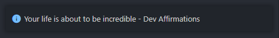

# Developer Affirmations README

A simple extension for vscode that reminds you of how amazing you are

## Features

Simply shows a message on startup and when you run the "Affirm Me" command

## Known Issues

No known issues :)

### Release Notes

Fixed a major bug that prevented the extension from working

---

**Enjoy and remeber your amazing!**
