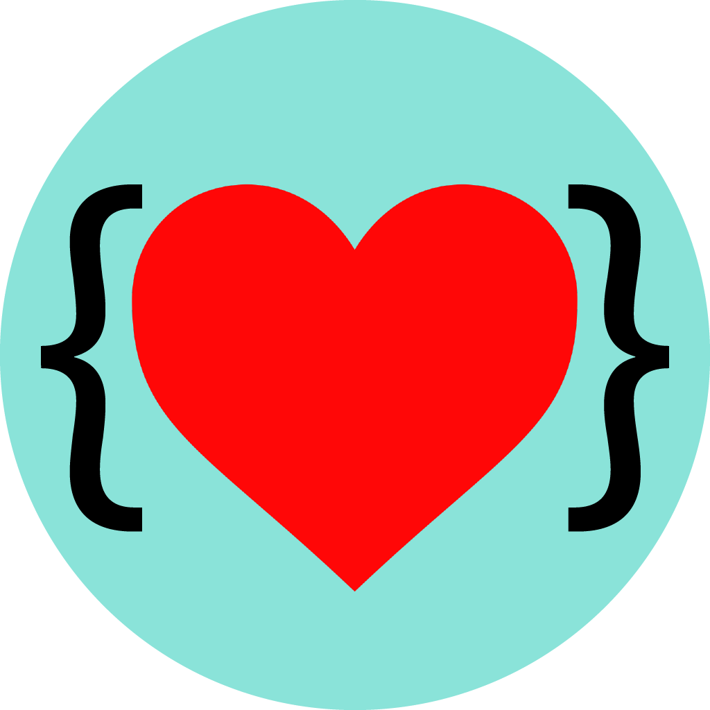

# Developer Affirmations README

A simple extension for vscode that reminds you of how amazing you are

## Features

Simply shows a message on startup and when you run the "Affirm Me" command

## Adding Features

Tutorial coming soon...

In the meantime, fork and pr.

To add affirmations edit [affirmations.ts](src/lib/affirmations.ts)

## Known Issues

The icon sucks - Working on a custom icon btw

### Release Notes

Fixed a few issues and improved performance

Check the [changelog](https://github.com/jamesinaxx/vscode-devaffirmations/blob/public/CHANGELOG.md) for more info

---

**Enjoy and remeber you're amazing!**
